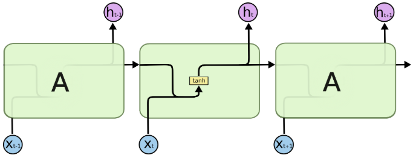
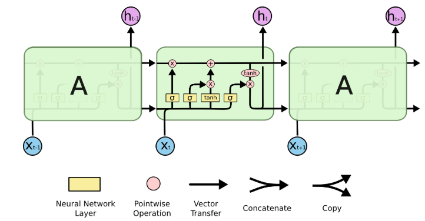
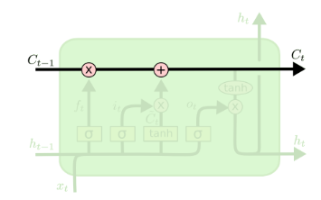
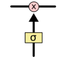
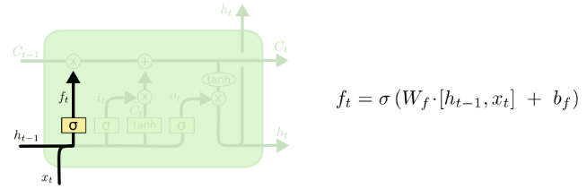
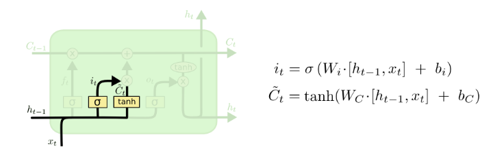

# TRM-USD-Inteligencia-Computacional

## RNN y redes LSTM

Todas las RNNs tienen la forma de una cadena de módulos repetitivos de red neuronal. En las RNN estándar, este módulo repetitivo tendrá una estructura simple, como una sola capa de *tanh*.

Las LSTM también son tipo cadena, pero el módulo de repetición tiene una estructura diferente. En lugar de tener una sola capa de red neuronal, hay cuatro que interactúan entre sí.

En el diagrama anterior, cada línea representa un vector completo, desde la salida de un nodo hasta las entradas de otros. Los círculos son operaciones puntuales, como la suma de vectores, los cuadros amarillos son capas de redes neuronales. Las de líneas juntas denotan concatenación, y las bifurcaciones denotan que su contenido se copia y las copias van a diferentes partes.

El estado de la celda es como una cinta transportadora. Corre port toda la cadena, con algunas interacciones lineales pequeñas. Es muy fácil que la información fluya sin cambios.

El LSTM pueden eliminar o agregar información al estado de la célula, cuidadosamente regulado por estructuras llamadas puertas. Las puertas son una forma de dejar pasar la información. Se componen de una capa de red neuronal *sigmoide* y una operación de multiplicación puntual.

La salida de la capa *sigmoide* son números entre 0 y 1, que describe cuánto de cada componente que debe dejarse pasar. 0 significa "no dejar pasar nada", y 1 significa "dejar pasar todo". Un LSTM tiene tres de estas puertas, para proteger y controlar el estado de la celda.

El primer paso es decidir qué información vamos a tomar del estado de la celda. Esta decisión la determina una capa sigmoidea llamada "capa de puerta olvidada". Examina  y , y genera un número entre 0 y 1 para cada número en el estado de celda .

El siguiente paso es decidir qué nueva información vamos a almacenar en el estado de la celda. Esto tiene dos partes. 

1. Una capa *sigmoide* llamada "capa de puerta de entrada" decide qué valores actualizaremos. 
2. Una capa *tanh* crea un vector de nuevos valores candidatos, $`\sqrt{C}`$, que podrían agregarse al estado. 
3. Se combinan los dos para crear una actualización del estado.

