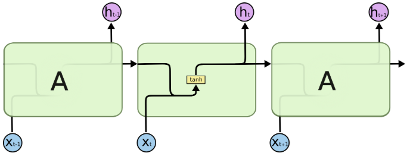
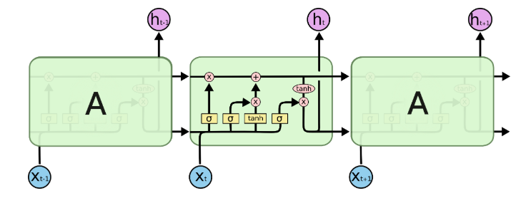

# TRM-USD-Inteligencia-Computacional

## RNN y redes LSTM

Todas las RNNs tienen la forma de una cadena de módulos repetitivos de red neuronal. En las RNN estándar, este módulo repetitivo tendrá una estructura simple, como una sola capa de *tanh*.

Las LSTM también son tipo cadena, pero el módulo de repetición tiene una estructura diferente. En lugar de tener una sola capa de red neuronal, hay cuatro que interactúan entre sí.

