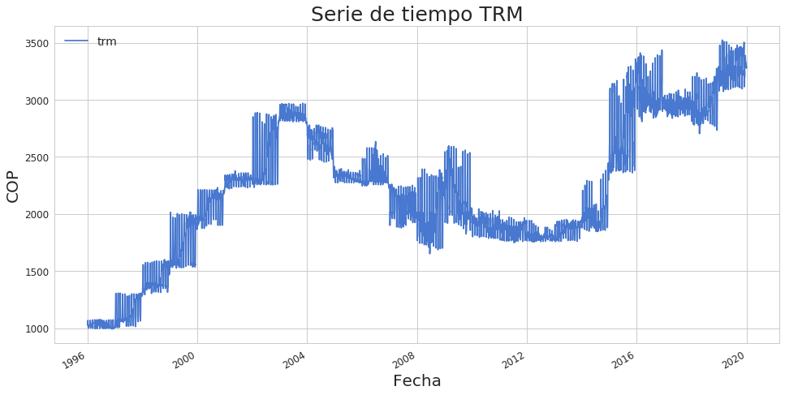
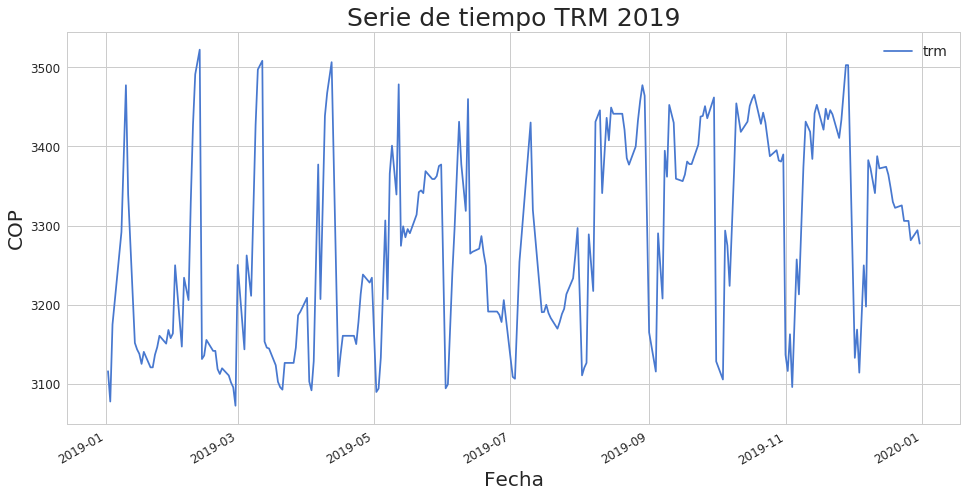

# Predicción de la TRM usando un modelo LSTM

### Author:
Johny Vallejo-Sánchez

*javallejos@eafit.edu.co*

Universidad EAFIT

### Materia:
Inteligencia Computacional Semestre 2020-01

### Profesor:
Santiago Medina PhD.

## Resumen

Este Notebook contiene el desarrollo de un modelo **inteligencia artificial** implementado en Python, usando la API de Keras, para predecir el valor de la TRM diaria usando datos históricos desde el año 1996 hasta 2019. Para ello se implementó una arquitectura de **Redes Neuronales Recurrentes** (RNN), usando un tipo especial de éstas conocido como Long Short Term Memory (LSTM). Se realizó un análisis descriptivo y exploratorio de los datos antes de su procesamiento, luego se agregó variables derivadas al dataset y se preprocesó los datos para la ingesta en el modelo. Se implementó 3 capas, la primera (LSTM) con 180 neuronas, la segunda un dropot para mejorar el backpropagation, y la tercera (dense) con 1 neurona que entrega la salida, almacenando los pesos de la red en un archivo en formato hdf5. Finalmente se evaluó el modelo tanto en training como en testing, obteniendo un error de predicción de $1.99 COP.

## Carga de librerías

A continuación se realiza la carga de las librerías necesarias para los cálculos y procesamiento de los datos:

+ **Numpy**: Manejo de matrices y vectores
+ **Pandas**: Procesamiento de dataset
+ **Matplotlib**: Gráficos
+ **Seaborn**: Estimadores estadísticos
+ **Sklearn**: Pre-procesamiento de datos y métricas del modelo
+ **Keras**: Arquitectura de RNN


```python
import numpy as np
import pandas as pd
import matplotlib.pyplot as plt
import seaborn as sns
from sklearn.preprocessing import MinMaxScaler
from sklearn.ensemble import RandomForestRegressor
from keras.models import Sequential
from keras.layers import Dense, Dropout, Activation, Input, LSTM, Dense
from keras.callbacks import ModelCheckpoint
from sklearn.metrics import mean_squared_error, mean_absolute_error
```
    Using TensorFlow backend.
    

## Carga de datos

Los datos están disponibles en un repositorio en [GitHub](https://github.com/Hausdorff94/TRM-USD-Inteligencia-Computacional) y se leen de manera remota. A continuación se muestra los primeros registros del dataset cargado.


```python
my_df = pd.read_csv('https://raw.githubusercontent.com/Hausdorff94/TRM-USD-Inteligencia-Computacional/master/data/dataTRM.csv')
my_df['Date'] = pd.to_datetime(my_df.Date).dt.date
my_df.head()
```


<table border="1" class="dataframe">
  <thead>
    <tr style="text-align: right;">
      <th></th>
      <th>Date</th>
      <th>infl</th>
      <th>smlv</th>
      <th>pob</th>
      <th>Inverargos t</th>
      <th>BCOLOM t</th>
      <th>EUR t</th>
      <th>TRM t</th>
      <th>TRM t-1</th>
      <th>TRM t-2</th>
      <th>TRM t+1</th>
    </tr>
  </thead>
  <tbody>
    <tr>
      <th>0</th>
      <td>1996-05-01</td>
      <td>0.2069</td>
      <td>142125</td>
      <td>38068050</td>
      <td>1558.75</td>
      <td>3774.81</td>
      <td>1.3349</td>
      <td>998.68</td>
      <td>994.50</td>
      <td>994.31</td>
      <td>997.06</td>
    </tr>
    <tr>
      <th>1</th>
      <td>1996-08-01</td>
      <td>0.2069</td>
      <td>142125</td>
      <td>38068050</td>
      <td>1558.75</td>
      <td>3774.81</td>
      <td>1.3330</td>
      <td>997.06</td>
      <td>998.68</td>
      <td>994.50</td>
      <td>997.06</td>
    </tr>
    <tr>
      <th>2</th>
      <td>1996-09-01</td>
      <td>0.2069</td>
      <td>142125</td>
      <td>38068050</td>
      <td>1557.50</td>
      <td>3774.81</td>
      <td>1.3312</td>
      <td>997.06</td>
      <td>997.06</td>
      <td>998.68</td>
      <td>1003.44</td>
    </tr>
    <tr>
      <th>3</th>
      <td>1996-10-01</td>
      <td>0.2069</td>
      <td>142125</td>
      <td>38068050</td>
      <td>1557.50</td>
      <td>3675.47</td>
      <td>1.3351</td>
      <td>1003.44</td>
      <td>997.06</td>
      <td>997.06</td>
      <td>1003.86</td>
    </tr>
    <tr>
      <th>4</th>
      <td>1996-11-01</td>
      <td>0.2069</td>
      <td>142125</td>
      <td>38068050</td>
      <td>1518.75</td>
      <td>3675.47</td>
      <td>1.3351</td>
      <td>1003.86</td>
      <td>1003.44</td>
      <td>997.06</td>
      <td>1002.59</td>
    </tr>
  </tbody>
</table>
</div>


```python
my_df.tail()
```

</style>
<table border="1" class="dataframe">
  <thead>
    <tr style="text-align: right;">
      <th></th>
      <th>Date</th>
      <th>infl</th>
      <th>smlv</th>
      <th>pob</th>
      <th>Inverargos t</th>
      <th>BCOLOM t</th>
      <th>EUR t</th>
      <th>TRM t</th>
      <th>TRM t-1</th>
      <th>TRM t-2</th>
      <th>TRM t+1</th>
    </tr>
  </thead>
  <tbody>
    <tr>
      <th>6121</th>
      <td>2019-12-24</td>
      <td>0.0359</td>
      <td>828116</td>
      <td>50374478</td>
      <td>18510.0</td>
      <td>44270.0</td>
      <td>1.1090</td>
      <td>3305.84</td>
      <td>3325.47</td>
      <td>3322.38</td>
      <td>3305.84</td>
    </tr>
    <tr>
      <th>6122</th>
      <td>2019-12-26</td>
      <td>0.0359</td>
      <td>828116</td>
      <td>50374478</td>
      <td>18120.0</td>
      <td>43700.0</td>
      <td>1.1122</td>
      <td>3305.84</td>
      <td>3305.84</td>
      <td>3325.47</td>
      <td>3281.40</td>
    </tr>
    <tr>
      <th>6123</th>
      <td>2019-12-27</td>
      <td>0.0359</td>
      <td>828116</td>
      <td>50374478</td>
      <td>18300.0</td>
      <td>44000.0</td>
      <td>1.1179</td>
      <td>3281.40</td>
      <td>3305.84</td>
      <td>3305.84</td>
      <td>3294.05</td>
    </tr>
    <tr>
      <th>6124</th>
      <td>2019-12-30</td>
      <td>0.0359</td>
      <td>828116</td>
      <td>50374478</td>
      <td>18040.0</td>
      <td>44000.0</td>
      <td>1.1206</td>
      <td>3294.05</td>
      <td>3281.40</td>
      <td>3305.84</td>
      <td>3277.14</td>
    </tr>
    <tr>
      <th>6125</th>
      <td>2019-12-31</td>
      <td>0.0359</td>
      <td>828116</td>
      <td>50374478</td>
      <td>18120.0</td>
      <td>44190.0</td>
      <td>1.1218</td>
      <td>3277.14</td>
      <td>3294.05</td>
      <td>3281.40</td>
      <td>3277.14</td>
    </tr>
  </tbody>
</table>
</div>

El dataset en el que se trabajará cuenta con las siguientes variables:

+ **Date**: Fecha del registro
+ **infl**: Índice de inflación
+ **smlv**: Salario mínimo mensual vigente
+ **pob**: Número de habitantes
+ **Inverargos t**: Precio de la acción Argos
+ **BCOLOM t**: Precio acción Bancolombia
+ **EUR t**: Euro/Dolar
+ **TRM t**: Valor del dolar en COP
+ **TRM t-1**: Resago-1
+ **TRM t-2**: Resago-2
+ **TRM t+1**: Valor a predecir


```python
df = my_df.copy()
df.count()
```

    Date            6126
    infl            6126
    smlv            6126
    pob             6126
    Inverargos t    6126
    BCOLOM t        6126
    EUR t           6126
    TRM t           6126
    TRM t-1         6126
    TRM t-2         6126
    TRM t+1         6126
    dtype: int64


El dataset cuenta con 6,126 registros, desde el 5 de enero de 1996 hasta el 31 de diciembre de 2019.


Ahora se reorganiza el dataset renombrando las columnas e indicando la fecha en su respectivo formato y fijarla como índice. Ahora la **variable explicativa** se llama **trm-plus-1**.


```python
# Rename columns
df.rename(columns={'Date' : 'date', 'Inverargos t' : 'inverargos', 'BCOLOM t' : 'bcolom', 
                   'EUR t' : 'eur', 'TRM t' : 'trm', 'TRM t-1' : 'trm-1', 'TRM t-2' : 'trm-2', 'TRM t+1':'trm-plus-1'}, inplace=True)
df['date'] = pd.to_datetime(df['date'], infer_datetime_format=True)
df.set_index('date', inplace=True)
df = df.astype(float)
df.head()
```

<table border="1" class="dataframe">
  <thead>
    <tr style="text-align: right;">
      <th></th>
      <th>infl</th>
      <th>smlv</th>
      <th>pob</th>
      <th>inverargos</th>
      <th>bcolom</th>
      <th>eur</th>
      <th>trm</th>
      <th>trm-1</th>
      <th>trm-2</th>
      <th>trm-plus-1</th>
    </tr>
    <tr>
      <th>date</th>
      <th></th>
      <th></th>
      <th></th>
      <th></th>
      <th></th>
      <th></th>
      <th></th>
      <th></th>
      <th></th>
      <th></th>
    </tr>
  </thead>
  <tbody>
    <tr>
      <th>1996-05-01</th>
      <td>0.2069</td>
      <td>142125.0</td>
      <td>38068050.0</td>
      <td>1558.75</td>
      <td>3774.81</td>
      <td>1.3349</td>
      <td>998.68</td>
      <td>994.50</td>
      <td>994.31</td>
      <td>997.06</td>
    </tr>
    <tr>
      <th>1996-08-01</th>
      <td>0.2069</td>
      <td>142125.0</td>
      <td>38068050.0</td>
      <td>1558.75</td>
      <td>3774.81</td>
      <td>1.3330</td>
      <td>997.06</td>
      <td>998.68</td>
      <td>994.50</td>
      <td>997.06</td>
    </tr>
    <tr>
      <th>1996-09-01</th>
      <td>0.2069</td>
      <td>142125.0</td>
      <td>38068050.0</td>
      <td>1557.50</td>
      <td>3774.81</td>
      <td>1.3312</td>
      <td>997.06</td>
      <td>997.06</td>
      <td>998.68</td>
      <td>1003.44</td>
    </tr>
    <tr>
      <th>1996-10-01</th>
      <td>0.2069</td>
      <td>142125.0</td>
      <td>38068050.0</td>
      <td>1557.50</td>
      <td>3675.47</td>
      <td>1.3351</td>
      <td>1003.44</td>
      <td>997.06</td>
      <td>997.06</td>
      <td>1003.86</td>
    </tr>
    <tr>
      <th>1996-11-01</th>
      <td>0.2069</td>
      <td>142125.0</td>
      <td>38068050.0</td>
      <td>1518.75</td>
      <td>3675.47</td>
      <td>1.3351</td>
      <td>1003.86</td>
      <td>1003.44</td>
      <td>997.06</td>
      <td>1002.59</td>
    </tr>
  </tbody>
</table>
</div>


## Serie de tiempo de la TRM

Observamos la serie de tiempo completa en la primera imagen, y en la segunda un zoom del último año, 2019.

```python
sns.set(rc={'figure.figsize':(16, 8)}, palette='muted', style = "whitegrid")
df.plot(y='trm')

plt.xticks(fontsize=12)
plt.yticks(fontsize=12)
plt.xlabel('Fecha', fontsize = 20)
plt.ylabel('COP', fontsize = 20)
plt.title('Serie de tiempo TRM', fontsize = 25)
plt.legend(fontsize = 14)
plt.show()
```





```python
df.loc['2019', 'trm'].plot()

plt.xticks(fontsize=12)
plt.yticks(fontsize=12)
plt.xlabel('Fecha', fontsize = 20)
plt.ylabel('COP', fontsize = 20)
plt.title('Serie de tiempo TRM 2019', fontsize = 25)
plt.legend(fontsize = 14)
plt.show()
```





## Análisis de correlación entre las variables

Para ver el impacto y correlación que existe entre las variables del dataset, usamos la correlación de Pearson y vemos cómo la variable de salida está correlacionada con las demás.


```python
colormap = plt.cm.inferno
plt.figure(figsize=(15,15))
plt.title('Correlación de Pearson', y=1.05, size=15)
sns.heatmap(df.corr(), linewidths=0.1, vmax=1.0, square=True, cmap=colormap, linecolor='white', annot=True)
plt.show()

plt.figure(figsize=(15,5))
corr = df.corr()
sns.heatmap(corr[corr.index == 'trm-plus-1'], linewidths=0.1, vmax=1.0, square=True, cmap=colormap, linecolor='white', annot=True);
```


Aquí encontramos algo interesante, la variable *infl* que corresponde al índice de **inflación** anual de país está inversamente correlacionado con el valor de la TRM, lo cual tiene sentido, pues en el país se comercializan muchos productos que son importados, los que se ven afectados directamente por el dolar; al variar la inflación, el valor del producto también fluctuará en su precio en dólares, dándole una explicación al precio del dolar según el índice de inflación.

Por otro lado, vemos que las variables con rezago no tienen una correlación directa con la variable de salida, pero sí tiene una correlación más fuerte las variables de *salario mínimo mensual* y *el número de habitantes en el país*.

## Función para predecir a *n* días a futuro.

Se crea una función para configurar el dataset que haga el forecast para el siguiente día (por default es 1 día, en el argumento *look_back*).


```python
def create_dataset(dataset, look_back=5):
    dataX, dataY = [], []
    for i in range(len(dataset)-look_back-1):
        a = dataset[i:(i+look_back)]
        dataX.append(a)
        dataY.append(dataset[i + look_back])
    return np.array(dataX), np.array(dataY)
```

## Ranking de las variables por importancia en el 

Usamos un *Random Forest Regressor* para estimar el peso de las variables involucradas en el modelo.


```python
# Scale and create datasets
target_index = df.columns.tolist().index('trm-plus-1')
dataset = df.values.astype('float32')

# Scale the data
scaler = MinMaxScaler(feature_range=(0, 1))
dataset = scaler.fit_transform(dataset)

# Set look_back to 1 for 1 day to future 
X, y = create_dataset(dataset, look_back=1)
y = y[:,target_index]
X = np.reshape(X, (X.shape[0], X.shape[2]))
```


```python
forest = RandomForestRegressor(n_estimators = 100)
forest = forest.fit(X, y)
```


```python
importances = forest.feature_importances_
std = np.std([forest.feature_importances_ for forest in forest.estimators_], axis=0)
indices = np.argsort(importances)[::-1]

column_list = df.columns.tolist()
print("Ranking de cada variable:")
for f in range(X.shape[1]-1):
    print("%d. %s %d (%f)" % (f, column_list[indices[f]], indices[f], importances[indices[f]]))

# Plot the feature importances of the forest
plt.figure(figsize=(16,7))
plt.title("Importancia", fontsize = 20)
plt.bar(range(X.shape[1]), importances[indices],
       color="salmon", yerr=std[indices], align="center")
plt.xticks(range(X.shape[1]), indices, fontsize = 16)
plt.yticks(fontsize = 16)
plt.xlim([-1, X.shape[1]])
plt.show()
```

    Ranking de cada variable:
    0. trm-plus-1 9 (0.984828)
    1. trm 6 (0.010641)
    2. trm-1 7 (0.002764)
    3. trm-2 8 (0.001353)
    4. bcolom 4 (0.000177)
    5. eur 5 (0.000106)
    6. inverargos 3 (0.000094)
    7. infl 0 (0.000019)
    8. smlv 1 (0.000009)
    


## Preprocesamiento de los datos

Aquí definimos la variable de salida y las variables explicativas en forma de matriz (array en Python). Con la librería *Scikit-learn*, escalamos los datos entre 0 y 1, y configuramos el dataset para ser ingresado directamente al modelo. Tomamos un dataset de Training y el otro de Testing, en una relación 85% y 15%, respectivamente. Se toma el 15% del final del dataset, ordenado por fecha, para no romper la serie de tiempo y tener continuidad de los datos en el tiempo.


```python
# Scale and create datasets
target_index = df.columns.tolist().index('trm-plus-1')
dataset = df.values.astype('float32')

# Scale the data
scaler = MinMaxScaler(feature_range=(0, 1))
dataset = scaler.fit_transform(dataset)

# Create y_scaler to inverse it later
y_scaler = MinMaxScaler(feature_range=(0, 1))
t_y = df['trm-plus-1'].values.astype('float32')
t_y = np.reshape(t_y, (-1, 1))
y_scaler = y_scaler.fit(t_y)
    
# Set look_back to 20 which is 5 hours (15min*20)
X, y = create_dataset(dataset, look_back=5)
y = y[:,target_index]

# Set training data size
train_size = int(len(X) * 0.85)
trainX = X[:train_size]
trainY = y[:train_size]
testX = X[train_size:]
testY = y[train_size:]
```

## Creación de la RNN tipo LSTM

Se creó un documento aparte explicando la arquitectura de un LSTM y puede [**consultarlo aquí**](https://github.com/Hausdorff94/TRM-USD-Inteligencia-Computacional/blob/master/README.md). Con la API Keras, se crea la red LSTM con la siguiente configuración:

+ **Capa 1**: LSTM con 180 neuronas.
+ **Capa 2**: Dropout que regulariza la red durante el entrenamiento, ignorando de manera random algunas neuronas, mejorando el backpropagation.
+ **Capa 3**: Dense, se encarga de la multiplicación matricial para dar el valor de salida de la red.

Sólo la capa 1 tiene una función de activación, que por default es la *tanh*.


```python
from keras.models import Sequential
from keras.layers import Dense, Dropout, Activation, Input, LSTM, Dense

# create a small LSTM network
model = Sequential()
model.add(LSTM(180, input_shape=(X.shape[1], X.shape[2]), return_sequences=False))
model.add(Dropout(0.2))
model.add(Dense(1, kernel_initializer='random_normal'))

model.compile(loss='mean_squared_error', optimizer='adam', metrics=['mae', 'mse'])
print(model.summary())
```

    _________________________________________________________________
    Layer (type)                 Output Shape              Param #   
    =================================================================
    lstm_1 (LSTM)                (None, 180)               137520    
    _________________________________________________________________
    dropout_1 (Dropout)          (None, 180)               0         
    _________________________________________________________________
    dense_1 (Dense)              (None, 1)                 181       
    =================================================================
    Total params: 137,701
    Trainable params: 137,701
    Non-trainable params: 0
    _________________________________________________________________
    None
    

El **número total de parámetros es 137,701**, lo que implicará un costo computacional alto. En la tabla anterior podemos ver la arquitectura de la red LSTM.

## Training del modelo

Se entrena el modelo con la red propuesta anteriormente y se guarda los pesos calculados de la red en el archivo *weights.best.hdf5*, para ser usados más tarde en las validaciones del modelo y también se usa en un posible despliegue en producción. Se toma como métrica el **error cuadrático medio**, MSE, que más adelante lo podemos convertir en **RMSE**. Adicional a ello se tiene la métrica del **error absoluto promedio**, MAE.


```python
# Save the best weight during training.
from keras.callbacks import ModelCheckpoint
checkpoint = ModelCheckpoint("weights.best.hdf5", monitor='val_mean_squared_error', verbose=1, save_best_only=True, mode='min')

# Fit
callbacks_list = [checkpoint]
history = model.fit(trainX, trainY, epochs=2500, batch_size=800, verbose=0, callbacks=callbacks_list, validation_split=0.1)
```

    
    Epoch 00001: val_mean_squared_error improved from inf to 0.06937, saving model to weights.best.hdf5
    
    Epoch 00002: val_mean_squared_error improved from 0.06937 to 0.04149, saving model to weights.best.hdf5
    
    Epoch 00003: val_mean_squared_error improved from 0.04149 to 0.01010, saving model to weights.best.hdf5
    
    Epoch 00004: val_mean_squared_error did not improve
    
    Epoch 00005: val_mean_squared_error improved from 0.01010 to 0.00201, saving model to weights.best.hdf5
    
    Epoch 00006: val_mean_squared_error improved from 0.00201 to 0.00106, saving model to weights.best.hdf5
    
    Epoch 00007: val_mean_squared_error did not improve
    
    Epoch 00008: val_mean_squared_error improved from 0.00106 to 0.00050, saving model to weights.best.hdf5
    
    ...
    
    Epoch 02496: val_mean_squared_error did not improve
    
    Epoch 02497: val_mean_squared_error did not improve
    
    Epoch 02498: val_mean_squared_error did not improve
    
    Epoch 02499: val_mean_squared_error did not improve
    
    Epoch 02500: val_mean_squared_error did not improve
    

## Performance en el entrenamiento

En los siguientes gráficos vemos que en Test como en Training, hay convergencia con cuando el número de Epochs aumenta:

+ **Epochs**: 2500
+ + **Tamaño del batch**: 800


```python
epoch = len(history.history['loss'])
for k in list(history.history.keys()):
    if 'val' not in k:
        plt.figure(figsize=(40,10))
        plt.plot(history.history[k])
        plt.plot(history.history['val_' + k])
        plt.title(k, fontsize = 34)
        plt.ylabel(k, fontsize = 27)
        plt.yticks(fontsize = 26)
        plt.xticks(fontsize = 26)
        plt.xlabel('epoch', fontsize = 27)
        plt.legend(['train', 'test'], loc='upper left', fontsize = 14)
        plt.show()
```


### MSE en el entrenamiento


```python
min(history.history['val_mean_absolute_error'])
```

    0.0071693467907607555


## Reentrenamiento del modelo

Tomando los mejores valores para los pesos de la red, se reentrena el modelo para mejorar el MSE


```python
# Baby the model a bit
# Load the weight that worked the best
model.load_weights("weights.best.hdf5")

# Train again with decaying learning rate
from keras.callbacks import LearningRateScheduler
import keras.backend as K

def scheduler(epoch):
    if epoch%2==0 and epoch!=0:
        lr = K.get_value(model.optimizer.lr)
        K.set_value(model.optimizer.lr, lr*.9)
        print("lr changed to {}".format(lr*.9))
    return K.get_value(model.optimizer.lr)
lr_decay = LearningRateScheduler(scheduler)

callbacks_list = [checkpoint, lr_decay]
history = model.fit(trainX, trainY, epochs=int(epoch/3), batch_size=500, verbose=0, callbacks=callbacks_list, validation_split=0.1)
```

    
    Epoch 00001: val_mean_squared_error did not improve
    
    Epoch 00002: val_mean_squared_error did not improve
    lr changed to 0.0009000000427477062
    
    Epoch 00003: val_mean_squared_error did not improve
    
    Epoch 00004: val_mean_squared_error did not improve
    lr changed to 0.0008100000384729356
    
    Epoch 00005: val_mean_squared_error did not improve
    
    Epoch 00006: val_mean_squared_error did not improve
    lr changed to 0.0007290000503417104
    
    ...
    
    Epoch 00828: val_mean_squared_error did not improve
    lr changed to 1.1386727160781698e-22
    
    Epoch 00829: val_mean_squared_error did not improve
    
    Epoch 00830: val_mean_squared_error did not improve
    lr changed to 1.0248054785491438e-22
    
    Epoch 00831: val_mean_squared_error did not improve
    
    Epoch 00832: val_mean_squared_error did not improve
    lr changed to 9.223249306942294e-23
    
    Epoch 00833: val_mean_squared_error did not improve
    

## Performance del modelo reentrenado.

Los gráficos de performance no muestran mejora sustancial entre el modelo reentrenado y el que ya se tenía, por lo que no valdría la pena un reentrenamiento en este caso.


```python
epoch = len(history.history['loss'])
for k in list(history.history.keys()):
    if 'val' not in k:
        plt.figure(figsize=(40,10))
        plt.plot(history.history[k])
        plt.plot(history.history['val_' + k])
        plt.title(k, fontsize = 34)
        plt.ylabel(k, fontsize = 27)
        plt.yticks(fontsize = 26)
        plt.xticks(fontsize = 26)
        plt.xlabel('epoch', fontsize = 27)
        plt.legend(['train', 'test'], loc='upper left', fontsize = 14)
        plt.show()
```


# Visualización de las predicciones en Test

Aquí se compara el dataset de Testing con el pronosticado. Los datos se encuentran aún escalados.


```python
# Benchmark
model.load_weights("weights.best.hdf5")

pred = model.predict(testX)

predictions = pd.DataFrame()
predictions['predicted'] = pd.Series(np.reshape(pred, (pred.shape[0])))
predictions['actual'] = testY
predictions = predictions.astype(float)

predictions.plot(figsize=(20,10))
plt.title('TRM en Testing',fontsize = 34)
plt.yticks(fontsize = 16)
plt.xticks(fontsize = 16)
plt.legend(loc='upper left', fontsize = 14)
plt.show()
```


## Distribución del error en testing

Podemos ver que el error se distribuye normalmente, con media aproximadamente cero, lo que por el teorema del límite central, el error es **independiente e identicamente distribuido**.


```python
predictions['diff'] = predictions['predicted'] - predictions['actual']
plt.figure(figsize=(10,10))
sns.distplot(predictions['diff']);
plt.title('Distribution of differences between actual and prediction')
plt.show()

print("RMSE : ", np.sqrt(mean_squared_error(predictions['predicted'].values, predictions['actual'].values)))
print("MAE : ", mean_absolute_error(predictions['predicted'].values, predictions['actual'].values))
#predictions['diff'].describe()
```


    RMSE :  0.010380426047365303
    MAE :  0.007691993497815268
    

# Visualización de la predicción como serie de tiempo

Se "desescalan" los datos y se grafican la serie de tiempo comparativa del valor real (azul) y el forecast (verde).


```python
pred = model.predict(testX)
pred = y_scaler.inverse_transform(pred)
trm = y_scaler.inverse_transform(np.reshape(testY, (testY.shape[0], 1)))
predictions = pd.DataFrame()
predictions['predicted'] = pd.Series(np.reshape(pred, (pred.shape[0])))
predictions['trm-plus-1'] = pd.Series(np.reshape(trm, (trm.shape[0])))

p = df[-pred.shape[0]:].copy()
predictions.index = p.index
predictions = predictions.astype(float)

ax = predictions.plot(x=predictions.index, y='trm-plus-1', figsize=(40,10))
ax = predictions.plot(x=predictions.index, y='predicted', figsize=(40,10), ax=ax)
index = [str(item) for item in predictions.index]

plt.title('Predicción vs Actual',fontsize = 34)
plt.yticks(fontsize = 26)
plt.xticks(fontsize = 26)
plt.legend(loc='upper left', fontsize = 24)
plt.show()
```


## Correlación entre el error y la TRM predicha

Se realiza un análisis de correlación entre el error de la predicción y el valor de la predicción y determinar si tienen relación dependiente significativa.

Claramente vemos que el error distribuye normal y tenemos un coeficiente de correlación de **0.45**, una correlación **débil** y lo corroboramos con el *p-value* **= 6.7e-47**, lo que nos indica que el valor de la correlación es estadísticamente significativo y podemos fiarnos de él.


```python
pred = model.predict(testX)
pred = y_scaler.inverse_transform(pred)
trm = y_scaler.inverse_transform(np.reshape(testY, (testY.shape[0], 1)))
predictions = pd.DataFrame()
predictions['predicted'] = pd.Series(np.reshape(pred, (pred.shape[0])))
predictions['trm-plus-1'] = pd.Series(np.reshape(trm, (trm.shape[0])))
predictions['diff'] = predictions['predicted'] - predictions['trm-plus-1']
g = sns.jointplot("diff", "predicted", data=predictions, kind="kde", space=0)
plt.title('Distribución del error y TRM predecida')
plt.show()
```


## RMSE

Finalmente, encontramos que las métricas para nuestro modelo son las siguientes:

+ **RMSE** = 1.98 COP
+ **MAE** = 1.59 COP


```python
print("RMSE : ", np.sqrt(mean_squared_error(predictions['predicted'].values, predictions['trm-plus-1'].values)))
print("MAE : ", mean_absolute_error(predictions['predicted'].values, predictions['trm-plus-1'].values))
#predictions['diff'].describe()
```

    RMSE :  1.9775977300479226
    MAE :  1.5877957839582961
    

## Conclusiones

+ La inclusión de variables externas, como el índice de inflación, es fundamental para darle explicatividad al modelo que estamos construyendo.
+ Realizar un análisis descriptivo y exploratorio es lo más importante al momento de crear un modelo de predicción, pues nos da idea de si hay valores faltantes, outliers o si es necesario incluir más variables.
+ Las redes neuronales recurrentes RNN del tipo LSTM son apropiadas para predecir variables de salida numéricas que dependen de datos del pasado o pueden repetir tendencias, como el caso de la TRM.

# Resumen del modelo
| Parámetros| RMSE   |MAE  |Modelo|
|-----------|--------|-----|------|
|   137,701 | 1.98   |1.59 |.hdf5 |